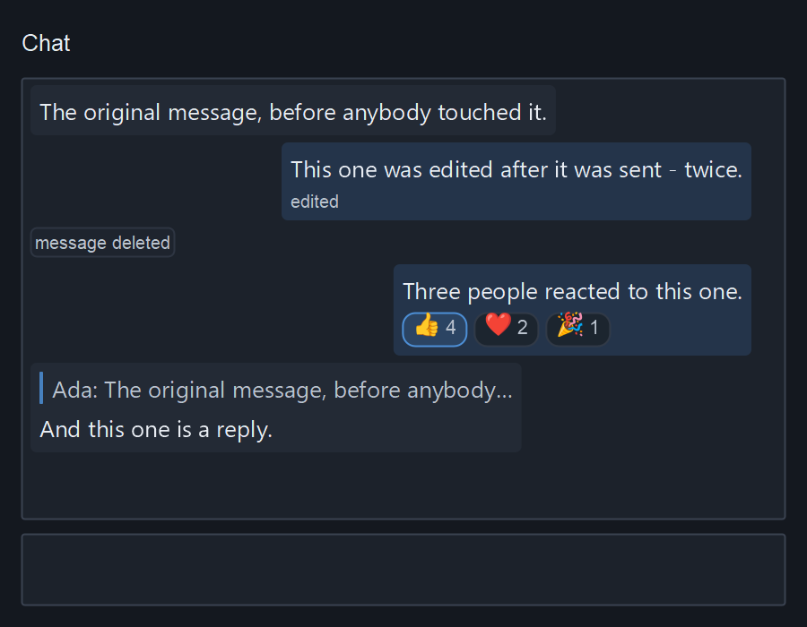

# simple_widgets

[Documentation](https://simple-eiffel.github.io/simple_widgets/) •
[GitHub](https://github.com/simple-eiffel/simple_widgets) •
[Issues](https://github.com/simple-eiffel/simple_widgets/issues)


A drawn widget toolkit for Eiffel on pure Win32 — no Vision2, no GTK, no native
controls. Every pixel is the toolkit's own.

Part of the [Simple Eiffel](https://github.com/simple-eiffel) ecosystem.

## Status

✅ **ALL SIX WAVES SHIPPED** — 103 classes (97 library + 5 devkit + 1 speechkit)
- Wave 5 (all 11 composites): tree table, spreadsheet doctrine whole,
  pivot, kanban, scheduler, gantt, file manager, query builder, form
  generator, org chart, TRUE DOCKING with collapsing reflow zones
- Wave 4 (all 15 concepts): SW_SCALE axis engine, line/bar/area/scatter,
  pie/donut + funnel + legend, gauge + sparkline, heatmap + treemap, sankey,
  world map (markers + UTC bands), force diagram, and the timezone tools
  (pickable band map + live world clock); the demo streams live
  frame costs into four instruments off one render-bell subscription
- 270 contract-assault tests passing (`screen_grab_marries_cairo` reads the
  real desktop and fails in a locked session — environment, not code)
- Dev instrument: SW_DEV_STUDIO — force-mesh + live reflected dossier +
  contract-armed live editing, floating or DOCKED (page stays live);
  compiled out of release-shaped builds via the devkit override
  (binary-measured absence)
- Every widget frame-proven in the live showroom (`demo/sw_demo.e`)
- Windows-only today (the SURFACE layer is Win32); everything above it is portable by design

## The idea

The classic Eiffel GUI chain was **WEL** (raw Win32) → **Vision2** (portable
widgets) → your application. The simple chain is:

```
simple_shell      the platform    (native window, pump, clipboard, keys)
simple_cairo      the substrate   (canvas, text, PNG)
simple_widgets    the vocabulary  (window runtime, theme, painter, 59 controls)
your application  the intent      (what exists and what happens)
```

simple_widgets itself is **pure Eiffel — zero C**: every Win32 external
lives in [simple_shell](https://github.com/simple-eiffel/simple_shell)
(deferred `SHELL_WINDOW`, effected here), every pixel in simple_cairo.

Before this library, a production face over simple_cairo meant ~2,000 lines of
boilerplate per application. That boilerplate is now a toolkit — with contracts.

## What ships today

**Foundations** — SW_WINDOW (runtime: one window, one cairo surface, phased
event pump, toasts, drawn dialogs, modal sheets, pick-and-drop), SW_WIDGET
(the contract spine), SW_THEME (tokens + metrics with WCAG invariants on its
own palette; dark and light), SW_PAINTER (the only class that touches cairo).

**Controls** — button (4 kinds), label (3 roles, honest wrapping), text box
(full engine: caret, disjoint multi-select, clipboard, Windows spell-check
with one-click suggestions, password mode with reveal eye and clipboard
denial), combo (an editable dropdown that IS a text box), select, check box,
switch, radio group, slider, number box, progress, chips.

**Layout** — row/column containership unifying Vision2's model with flex
(grow / min / max), card, titled group, separator, spacer (the pinned-footer
idiom), splitter (contract-clamped ratio).

**Data & chrome** — virtualized list (10,000 rows scroll like ten; selection,
double-click activation, per-row pick-and-drop pebbles), scroll area, tabs,
drawn menus (built fresh on every open), menu bar (builder agents), toolbar
(toggles queried by label), status bar.

**Dialogs & media** — drawn modal alerts, a complete drawn **file dialog**
(open/save, dirs-first listing, extension filter — base PATH/DIRECTORY only),
PNG display with contain scaling; a shell-drop zone (WM_DROPFILES
through the widget spine to any opted-in control).

**Services** — clipboard (Unicode, surrogate-safe, hardened against
clipboard-history races), modifier keys, ISpellChecker wrapper.

## Quick start

```eiffel
local
    window: SW_WINDOW
    theme: SW_THEME
    root: SW_COLUMN
do
    create theme.make_dark
    create window.make ("hello", 100, 100, 900, 700, theme)
    create root.make
    root := root.with_padding (16.0).with_gap (12.0)
    root.put (create {SW_LABEL}.make_body ("Every pixel here is the toolkit's own."))
    root.put (create {SW_BUTTON}.make_primary ("Go", agent on_go))
    window.set_root (root)
    window.run
end
```

Add to your ECF:

```xml
<library name="simple_widgets" location="$SIMPLE_EIFFEL/simple_widgets/simple_widgets.ecf"/>
```

Ship `cairo.dll` beside your executable (every finalize wipes F_code — copy it
back after building).

## Shaped text (simple_shaping)

Cairo's "toy" text API has no bidi, no shaping, no font fallback and no colour
emoji: Hebrew comes out left-to-right and unjoined, a mixed Hebrew/Latin line is
scrambled, and every emoji is a tofu box. The toolkit can now hand its
text to [simple_shaping](https://github.com/simple-eiffel/simple_shaping)
instead — bidi, script itemization, glyph shaping, deterministic font fallback,
and emoji as the same Noto picture on every screen.

**It is opt-in, and the toy path is still the default.** Turn it on once, on the
window:

```eiffel
window.enable_shaped_text
```

That builds one `SW_SHAPING` kit — one `SIMPLE_SHAPING` facade plus one
`SHAPING_CAIRO_BRIDGE` — for the whole window, prepends the theme's UI face for
Latin only (a theme face is Latin-only by design; Hebrew and Greek keep
simple_shaping's own scholar-grade order), and hands it to the painter. The kit
survives theme swaps and offscreen re-allocations, so the layout cache and the
decoded emoji surfaces are built once.

`SW_CHAT_THREAD` uses it the moment it is there: bubbles are laid out by
`SIMPLE_SHAPING.layout`, bubble height is `layout.total_height` (never a line
count times a constant — a line carrying an emoji box is taller than one that
does not), and the old greedy word wrap is skipped. Everything else about the
widget is unchanged: `add_message`, `append_to_last`, sticky-bottom, wheel
scrolling and `content_h` behave exactly as before, on either path.

Custom widgets reach it the same way:

```eiffel
if a_p.has_shaping and then attached a_p.shaping as al_kit then
    l_layout := al_kit.layout_for (my_text, inner_width_px, pixel_size)
    a_p.draw_shaped_layout (l_layout, l_x, l_y)   -- (l_x, l_y) is a TOP-LEFT
end
```

`SW_LABEL` and the rest of the chrome deliberately stay on the toy path for now
— see "Known limits" below.

**Re-layout at resize END, not per tick (R10).** `SW_WINDOW` publishes its own
`busy_ticks` debounce to the painter as `SW_PAINTER.is_resize_storm`; a shaped
widget keeps the layouts it has while the frame is being dragged and re-lays-out
once the drag settles. A *content* change never waits — a message arriving
mid-drag still appears.

### The chat thread's scrollbar (0.5.0)

`SW_CHAT_THREAD` draws a vertical scrollbar along its own right edge —
track and thumb, sized from `SW_THEME`'s `text_scale` the way every other
themed dimension in this toolkit scales (`Scrollbar_w` is 12 px at 1x) —
whenever its content overflows the pane (`scrollbar_visible`, driven by
`max_scroll > 0.0`). It is invisible, and inert, the rest of the time.

**Follow-the-tail.** The thread starts, and stays, sticky at the bottom:
a new message auto-scrolls the view with it. Scrolling up — the wheel,
dragging the thumb, clicking the track, PageUp, Home — breaks stickiness;
scrolling back down to within 2 px of the bottom — the wheel, a drag,
clicking the track, PageDown, End — restores it. Every one of those
entry points funnels through the one `scroll_to (a_y)` query, so the
`[0, max_scroll]` clamp and the sticky law are enforced in exactly one
place.

**Mouse.** Press the thumb and drag it; click the bare track above or
below the thumb to page toward the click. Both go through the widget's
existing `handle_click` / `handle_drag` / `handle_release` — no new input
plumbing in `SW_WINDOW`.

**Keyboard.** The thread now accepts keyboard focus (`accepts_focus` is
`True`, joining the Tab ring the way `SW_LIST` does) — click it once, then
PageUp, PageDown, Home and End move it, the same virtual-key vocabulary
`SW_LIST` already uses.

```eiffel
thread.scroll_to (0.0)                 -- jump to the top, programmatically
thread.scroll_to (thread.max_scroll)   -- jump to the tail
thread.is_sticky                       -- following the conversation right now?
```

**The fix underneath it.** Before 0.5.0, `draw` clamped `scroll_y` once
*per bubble*, against `content_h` while it was still being accumulated —
the very first bubble always saw a content height of 8.0 (the loop's own
starting value), so on any pane taller than 8 px the clamp reset
`scroll_y` to ~0 on every single frame, before the true total was ever
known. The tail could never scroll into view and no wheel delta survived
the next repaint. `draw` now runs two passes: PASS 1 measures every
bubble with no drawing and no dependence on `scroll_y`, so `content_h` is
the real total *before* anything is clamped against it; PASS 2 draws at
the one offset the frame settled on.

### Line breaks in a bubble (0.6.0)

A chat message is not one paragraph. `SW_CHAT_THREAD` cuts every message at
its explicit line breaks before either path lays anything out:

| in the message      | what happens                                    |
|---------------------|-------------------------------------------------|
| `LF`                | ends the line; never drawn                      |
| `CRLF`              | ONE break, not two                              |
| a lone `CR`         | ends the line; never drawn                      |
| `TAB`               | becomes a space (there are no tab stops here)   |
| two or more breaks  | at most ONE empty line — a bounded blank        |
| a trailing break    | dropped: a message ending in a newline has no empty last line |

Wrapping then applies WITHIN a paragraph, and a bubble's height is its real
line count.

```eiffel
thread.paragraphs_of (some_text)   -- the cut, as a public contracted query
thread.display_text (i)            -- message i as the bubble SHOWS it
```

On the shaped path this means **one `SHAPED_LAYOUT` per paragraph**, because
simple_shaping lays out a paragraph and treats an LF as a mere break
*opportunity* — it still shapes and paints the character, which is where the
square boxes came from. `shaped_layouts` is a flat list in message order and
`layout_spans` says which layouts belong to which message
(`shaped_layouts [base .. base + span - 1]`). A message with no line breaks
is still exactly one layout.

**Add a message whenever you like (0.6.1).** A layout can only be made by
`SW_SHAPING.layout_for`, at an inner width and a pixel size the widget does not
learn until the painter hands them over inside `draw` — so `add_message` cannot
keep `layout_spans` in step with `messages`, and between two frames the spans
describe the frame that was drawn. That is normal, and the widget says so:
`laid_out_revision = revision` is its own answer to *are these current?*. In
0.6.0 the class invariant demanded one span per message unconditionally, so
`add_message` after a first shaped frame failed **its own invariant** in any
build that checks one — which is every workbench and `ec.sh test` build, and
precisely what a live chat client does on every event after its first frame. It
never bit a shipped client only because finalized code checks no invariants.

### Selecting and copying from a bubble (0.6.0)

Bubbles are selectable text. Press and drag inside one to select; double-click
takes the word; Escape clears; Ctrl+C — or the right-click menu (Copy, Select
Message, Select None) — copies through `SW_CLIPBOARD`, the same door
`SW_TEXT_BOX` uses.

```eiffel
thread.has_selection      -- is there a range?
thread.selected_text      -- exactly what copy_selection would hand the clipboard
thread.select_message (2) -- the whole of bubble 2
thread.clear_selection
```

Granularity is per CHARACTER on the toy path and per GLYPH CLUSTER on the
shaped path, walked over `GLYPH_RUN`'s own `cluster_map` and `x_positions`
(`SHAPED_LINE` reserves `character_index_at_x` for a future simple_shaping
cycle and does not implement it). Right-to-left runs are handled by direction:
the boundary at a cluster's left edge is the caret AFTER that character.

**Selection lives inside one bubble.** A drag that wanders out runs to the
anchor bubble's own ends and stops — a thread is a list of utterances by
different speakers, and a range spanning three of them has no honest text to
hand the clipboard. Cross-bubble selection is not supported and is not
planned.

### The per-message menu — edit, react, delete, reply (0.7.0)

A bubble used to be write-once. `add_message` put one on the thread and
`append_to_last` grew it while a token stream ran, and after that nothing could
change it — which is not what a chat server does. A server folds *edit*,
*delete* and *reaction* events over the message they name, and a *reply* is a
message carrying a parent's id. The thread now has a door for each.

```eiffel
thread.set_message (2, {SW_CHAT_THREAD}.Role_keep, "the corrected text")
thread.mark_edited (2)                       -- a small muted "edited" marker
thread.tombstone (3)                         -- a visible placeholder, never a gap
thread.set_reactions (4, row)                -- emoji + tally chips, mine outlined
thread.set_reply_quote (5, "Ada", "the parent message")

thread.is_edited (2)        thread.is_tombstone (3)
thread.reactions_of (4)     thread.has_reply_quote (5)
thread.reply_quote (5)      thread.quote_line (5)     thread.drawn_quote (5)
thread.bubble_height (4)    -- what the last frame measured it at
```

`Role_keep` is not a role: it is what an edit passes when the words change and
the speaker does not, which is the common case (a server's edit event carries
no new author).

**Every one of these is a CONTENT CHANGE, and that is the whole safety story.**
A content change has meant *bump `revision`* since 0.5.0. `laid_out_revision`
then lags, the invariant's `spans_match_when_current` guard goes quiet for
exactly one frame, `refresh_layouts` rebuilds and records — the same door
`add_message` has always gone through, and the reason 0.6.1's fix generalizes to
mutations it never saw. Nothing here re-shapes: a span indexes layouts only
`SW_SHAPING.layout_for` can make, at an inner width and a pixel size the widget
does not learn until `draw`.

**A delete is a tombstone, never a gap.** `tombstone` keeps the bubble where it
is, at reduced height, muted, saying *message deleted* — because the ORDER of a
thread is part of its record and a vanished bubble silently rewrites who
answered whom. It does really destroy the text (`messages.i_th (i).text` is
emptied, not hidden), so no selection can reach it and `copy_selection` has
nothing to take; hiding the words behind a flag would leave them one query away
from anyone with a debugger, which is not what *deleted* means. Every
decoration goes with it: a reaction to a deleted message is a claim about words
nobody can read. `tombstone` is terminal and idempotent — the other four
commands require a live message.

**The four bands.** A bubble is now up to four stacked bands inside its own
padding: a one-line reply quote (elided at the inner width — a quote that
wrapped would be a second message), the text, the "edited" marker, and a
reaction row that wraps rather than run off the bubble's edge. Each band is
MEASURED, never assumed, and each therefore changes `content_h` and the
scrollbar thumb. Stickiness survives all of it exactly the way `add_message`
preserves it: a thread parked at the tail is re-parked; a reader who has
scrolled up is not yanked.

**Both text paths.** The quote and each chip's emoji go through the shaping kit
when there is one — so a Hebrew quote reads right-to-left and a reaction carries
the same Noto picture as the bubbles do — and fall back to cairo's toy metrics
when there is not. The decoration layouts are kept OUT of `shaped_layouts` on
purpose: `layout_spans` tiles that list exactly, and a quote laid into it would
make the tiling a lie.

**The two questions a host's right-click asks:**

```eiffel
thread.message_at (px, py)    -- which bubble, 0 for none
thread.reaction_at (px, py)   -- [message, emoji], or [0, ""] off every chip
```

Both are answered from the geometry the last `draw` recorded — the same frame
cache `hit_test` has used since 0.6.0 — so neither needs a painter, and a menu
and a selection can never disagree about which message was meant. A tombstone
answers `message_at` with its own index: a deleted message is still a message a
menu may want to offer something on.



*Left to right down the thread: an untouched bubble, an edited one with its
marker, a tombstone, a bubble carrying three reaction chips with the reader's
own outlined, and a reply with its elided quote — 2x text, shaped path.*

### The runnable folder

Shaped text adds freight beside the executable. A shipped app's folder is:

```
myapp.exe
cairo.dll                        <- from $SIMPLE_EIFFEL/simple_cairo/
LICENSE-ASSETS.md                <- from $SIMPLE_EIFFEL/simple_shaping/
assets/noto-emoji/png/128/...    <- from $SIMPLE_EIFFEL/simple_shaping/assets/
```

`SW_SHAPING.make` resolves the artwork against the directory of the **running
executable**, never the working directory (a shortcut, a service, an Explorer
double-click and a debugger all differ). `tools/stage_runnable.sh` stages all
three:

```bash
tools/stage_runnable.sh EIFGENs/sw_demo/F_code
```

Missing artwork is not a crash — simple_shaping degrades to a note and a box —
but the robot will not be a robot.

**This library's own test target does not stage the assets.** Copying 3,768
files (about 20 MiB) into `F_code` on every build is a poor trade for a suite
that reads four of them, so the shaped-text tests look for the artwork beside
the exe FIRST (so a staged folder is exercised when there is one) and fall back
to `$SIMPLE_EIFFEL/simple_shaping/assets/noto-emoji/png/128`. Applications get
no such fallback: stage the folder.

### Known limits

- `SW_LABEL`, `SW_BUTTON` and the rest of the chrome still draw through
  `SW_PAINTER.text`. Their `preferred_width` / `preferred_height` are cairo toy
  advances, and every layout in the toolkit is measured from them, so swapping
  their metrics is a separate, wider change — not a small safe one.
- One kit per window, per SCOOP processor. A background processor that wants to
  measure text creates its own.
- Every mnemonic is a MENU BAR mnemonic. Alt+letter opens a pad; it does not
  move focus to a labelled control, because no widget declares an `&` label
  yet. See *The Alt door* below.

## Keyboard: accelerators and mnemonics (0.6.0)

A key used to reach exactly one place — the focused widget. An application
that wanted Ctrl+N to mean *New* wherever the caret happened to be had nowhere
to say so. Now it does:

```eiffel
window.register_accelerator (78, True, False, False, agent new_document)
        -- Ctrl+N, anywhere in this window, whoever holds focus
window.register_accelerator (83, True, False, True,  agent save_as)
        -- Ctrl+Shift+S is a DIFFERENT key: the modifier state must match exactly
```

`accelerator_for` answers which entry claims a key (0 = none),
`fire_accelerator` runs it, `clear_accelerators` empties the table. A modifier
is required — an unmodified accelerator would take the letter out of every
text box in the window.

**An unclaimed key is still the widget's own.** Ctrl+A / C / V / X / Z / Y
reach the focused `SW_TEXT_BOX` exactly as they always did unless an
accelerator claims them. No existing signature changed:
`SW_WIDGET.handle_key (a_vk, a_shift)` is untouched.

**Both key doors are tried**, which is not an implementation detail you can
ignore when reading the dispatch: simple_shell's WM_KEYDOWN filter forwards
only the stepping keys (arrows, Home/End, Page keys, Delete, OEM plus/minus)
as event 4, so a letter never arrives that way. Ctrl+C arrives as event 3 —
the WM_CHAR control code 3 — which is how `SW_TEXT_BOX` has always read it.
The table is consulted on both, and a hit on the key-down door swallows the
WM_CHAR that trails it.

### Menu mnemonics

An `&` in a menu title or item underlines the letter after it:

```eiffel
bar.add_menu ("&File", agent build_file_menu)     -- draws "File", F underlined
menu.add_item ("Select &All", "Ctrl+A", True, agent select_all)
menu.add_item ("R&&D", "", True, agent open_rd)   -- literal "R&D", no mnemonic
window.set_menu_bar (bar)                          -- give this bar the Alt key
```

`labels` and `items.label` keep the PLAIN reading, so every existing reader
sees the text it always saw; the declaration survives in `raw_labels`, where
`menu_for_mnemonic` and `item_for_mnemonic` find it. While a menu is open a
BARE letter picks the item that underlines it — the second half of the
*Alt+F, then N* gesture — and that half works today.

### The Alt door — the gap 0.6.0 named, closed (0.6.1)

0.6.0 shipped the mnemonics with a hole named in this README: Alt+letter never
reached the window at all, because simple_shell answered `WM_SYSKEYDOWN` for
the OEM plus/minus pair alone. **simple_shell 1.9.3 closed its half** —
Alt+A..Z and Alt+0..9 now arrive as the ordinary key-down event 4 by virtual
key, with the `WM_SYSCHAR` behind them swallowed so `DefWindowProc` cannot
open the system menu behind the application's back.

That swallow is why the toolkit still saw nothing: `activate_mnemonic` sat on
the WM_CHAR door, which the shell now never knocks on for an Alt combination,
so the gesture reached the accelerator table and died there unless the host
had registered Alt+F/E/R/H by hand. **It no longer has to.** With Alt held and
no accelerator claiming the key, the window tries its own `menu_bar`:

```eiffel
window.set_menu_bar (bar)   -- this, and nothing else, is what Alt+F needs
```

Order is the contract: the accelerator table is asked **first**, so a host that
really wants Alt+F for itself still keeps it; the menu bar is asked **second**;
the focused widget is asked **last**, so Alt+letter no longer disappears.
`activate_mnemonic` stays public — a button or a Ctrl accelerator may still
drive it — and the WM_CHAR path is untouched for shells that deliver Alt that
way. **Ctrl accelerators are unaffected.**

`SW_WINDOW.simulate_key_down (a_vk, a_ctrl, a_alt, a_shift)` delivers a
key-down through the **same** `route_key_down` the native event 4 runs, with
the modifier state as parameters instead of a live `GetKeyState`. It is how the
assault proves this offscreen without pressing Alt on anybody's desktop, and
it is the wheel door's (`simulate_wheel`) twin.

## Margins and padding

Controls do not sit on the window edge. The toolkit carries Vision2's spacing
model as three theme tokens, and every one of them **scales with the text**, so
an application drawing at 2x (`theme.set_text_scale (2.0)`) gets 2x margins
without touching a layout.

| Vision2 (`EV_BOX`, ISE 25.02) | simple_widgets | 1x | Meaning |
|---|---|---|---|
| `EV_BOX.border_width` | `SW_THEME.border_width` | 12 px | space between a container's edge and its content |
| `EV_BOX.padding` / `padding_width` | `SW_THEME.padding` | 8 px | space between siblings |
| *(no Vision2 name — a native control owns its own margins)* | `SW_THEME.control_inset` | 11 px | space between a control's edge and its label |
| `EV_LAYOUT_CONSTANTS.default_button_height` | `SW_PAINTER.min_control_height` | measured | ascent + descent + 2 × `control_inset` |
| `EV_LAYOUT_CONSTANTS.dialog_unit_to_pixels` | `SW_THEME.text_scale` | ×1.0 | the one knob every token is multiplied by |

**The border is applied once.** `SW_WINDOW` insets its root widget by
`theme.border_width` on all four sides (`SW_WINDOW.content_border`), and
`SW_DIALOG` does the same inside its card. Every plain box therefore defaults
its own `padding` to **0** — exactly as Vision2 defaults `EV_BOX.border_width`
to 0 (`EV_BOX_I.Default_border_width`) and lets the dialog set it
(`EV_MESSAGE_DIALOG` does `vb.set_border_width (10)`). Nest boxes as deep as you
like: the content is inset **once**.

Boxes that *are* a surface in their own right keep a border: `SW_CARD`
(`control_inset`), `SW_GROUP` (`border_width`), `SW_FILE_DIALOG`
(`padding × 0.75`).

**An explicit value always wins.** `with_padding` / `set_padding` and
`with_gap` / `set_gap` mark the box explicit (`padding_is_explicit`,
`gap_is_explicit`), and an explicit value — **including 0.0** — is never
overwritten by the theme, at any scale. Layout reads `effective_padding (p)` and
`effective_gap (p)`; a box that was never told stays theme-driven.

```eiffel
create col.make                     -- gap = theme padding, border = 0
create page.make
page.put (col)                      -- nested: still no second border
win.set_root (page)                 -- the window supplies the ONE border

create tight.make
tight := tight.with_gap (0.0)       -- explicit 0 stands, even at 2x text
```

**Controls are never smaller than their font.** `SW_PAINTER.text_extent` is
cairo's own `font_extents` ascent + descent for the *selected* font, so it
already carries `text_scale`; `min_control_height` adds the inside inset above
and below, and `min_control_width (s)` does the same either side of a measured
advance. `SW_BUTTON`, `SW_TEXT_BOX`, `SW_CHECK_BOX` and `SW_NUMBER_BOX` clamp
their natural height up to it — a larger explicit anchor still wins through
`clamped_height`. Measured at 1x → 2x: button 38 → 75, text box 42 → 80, check
box 38 → 75, number box 38 → 75, label 24 → 47 px.

`SW_LABEL.line_step` is measured too (`text_extent` + the theme's leading), so a
wrapped label's line step and its painted glyphs agree at every scale; it used
to step by the *nominal* `size + 9.0` while painting at `size × text_scale`.

Evidence: `evidence/margins-before.png` (root at 0,0 — controls flush on the
edge) against `evidence/margins-after.png`, plus `margins-1x.png` /
`margins-2x.png` for the control-size proof. All rendered offscreen onto a cairo
image surface; see `testing/sw_margins_assault.e`.

## The rules (spec S01)

| # | Rule |
|---|------|
| R1 | One language: Eiffel over inline C externals |
| R2 | Painter monopoly: only SW_PAINTER touches CAIRO_CONTEXT |
| R3 | Contracts everywhere |
| R4 | Theme is truth: tokens only, no literal colours in widgets |
| R5 | Agents wire behaviour |
| R6 | Immediate feedback: every interaction shows its effect now |
| R7 | Nothing native: menus, dialogs, file pickers — all drawn |
| R8 | Unicode first: STRING_32 throughout, surrogates paired at the borders |

## Documentation

- **[Core documentation](https://simple-eiffel.github.io/simple_widgets/)** — overview, architecture, rules, quick start
- **Per-control pages** — every shipped class has its own page under
  `docs/widgets/` with a complete description, working examples, known limits,
  bugs & gotchas, and extension plans
- **The living cookbook** — `demo/sw_demo.e`, the showroom exercising everything
- **Specs** — `specs/S01` (layers & rules), `S02` (the full-coverage catalog,
  waves 1–6), `S03` (the appearance model); research surveys under
  `specs/research/`

## Build & test

```bash
# the demo showroom
/d/prod/ec.sh test -config simple_widgets.ecf -target sw_demo
cp $SIMPLE_EIFFEL/simple_cairo/cairo.dll EIFGENs/sw_demo/F_code/
./EIFGENs/sw_demo/F_code/simple_widgets.exe

# the contract assault (all assertions live)
/d/prod/ec.sh test -config simple_widgets.ecf -target simple_widgets_tests
cp $SIMPLE_EIFFEL/simple_cairo/cairo.dll EIFGENs/simple_widgets_tests/F_code/
./EIFGENs/simple_widgets_tests/F_code/simple_widgets.exe
```

## Roadmap

**Waves 1–4 are COMPLETE.** Wave 3 closed with the dropzone and the
dev-mode suite (inspector, force mesh, dev studio — devkit-only classes,
binary-proven absent from release shapes). Wave 4 shipped all fifteen
visualization concepts in six movements — the SW_SCALE axis engine,
line/bar/area/scatter, pie/donut + funnel + shared legend, gauge +
sparkline, heatmap + treemap, sankey ribbons, the coarse world map and
the public force diagram — plus the timezone coda (pickable band map +
live world clock). The same day delivered the event layer (SW_EVENT,
ACTION_SEQUENCE architecture), Vision2-style sensitivity
(set_enabled_when), and subscribable render bells.

**Wave 5 is COMPLETE, in one sitting**: tree table, the SPREADSHEET
doctrine whole (graduated cells engine - ranges, aggregates with a
stated assaulted law, TSV/CSV, command undo - under a formula-bar
widget), pivot, kanban moved by pebbles, scheduler with assaulted
overlap lanes, gantt with elbow dependencies, file manager, query
builder, form generator, org chart with its centring law proven, and
TRUE DOCKING - reflow zones that collapse when empty.

**Wave 6 shipped its buildable heart the same day**: carousel, gallery,
the codec-agnostic media transport, the crop marquee, chat thread with
streaming and the sticky-tail law, the AI prompt view - and DICTATION:
whisper.cpp through simple_speech + simple_audio as a speechkit-cluster
service, with a REAL transcription in the assault suite on every run.
Honestly future-gated and stated: playback codecs, PDF view, smart
textarea.

**The catalog is shipped.** What remains is deepening: the standing
threads (on_[event] queue sweep, modal-resize round two, the ISE/Gobo
audit, simple_events graduation) and every per-control future listed
on its own page.

**The full plan:** [What's Still Coming](https://simple-eiffel.github.io/simple_widgets/roadmap.html)
— per-wave detail; `specs/S04-ROADMAP.md` is the per-control checkbox
docket, harvested from the doc pages so the two cannot drift.

## License

MIT — see [LICENSE](LICENSE).
